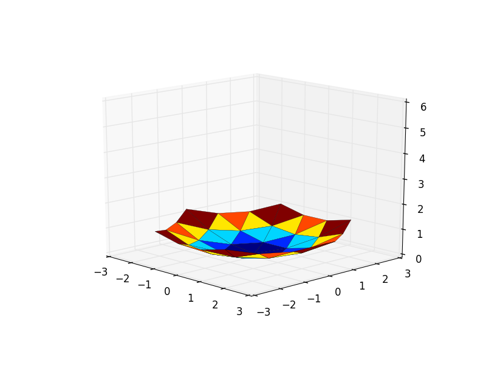

# parabola

This is some parabola generation software. It makes svg files for a laser cut parabola. I used Ponoko which seemed really expensive

You'll need to install python, numpy, scipy and matplotlib (which if you don't have already, what are you doing? You're missing out on the greatest things in life and will die angry and empty.)

and also the package svgwrite (which is kind of meh. svg itself is so simple):

`pip install svgwrite`

The most important parameters are in the file. L is length of triangle. N is number of triangles.

To see the parabola run the command

`python plot_parabola.py`

To generate the svg files run

`python generate_triangles.py`

The rest is possibly useful trash that I generated as intermediary steps.

Bailing out, you're on your own. Good luck.
